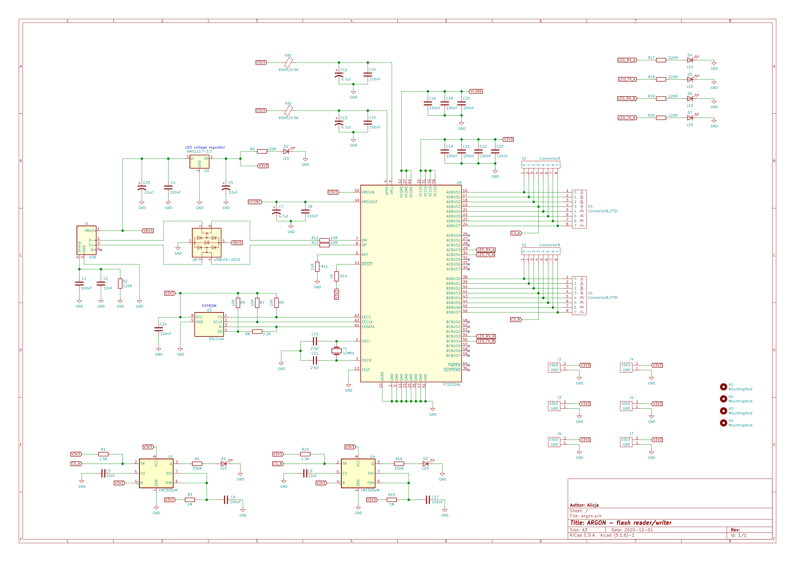
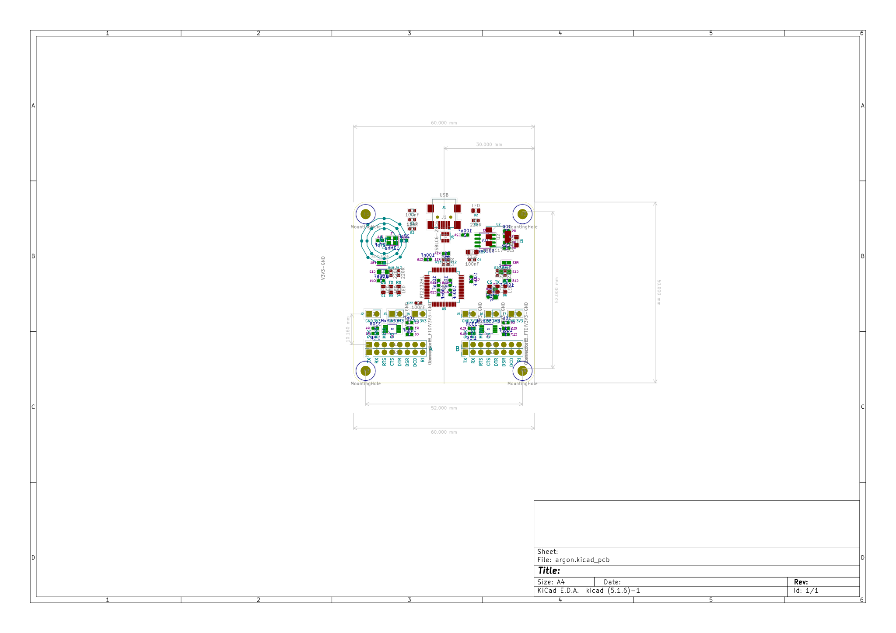
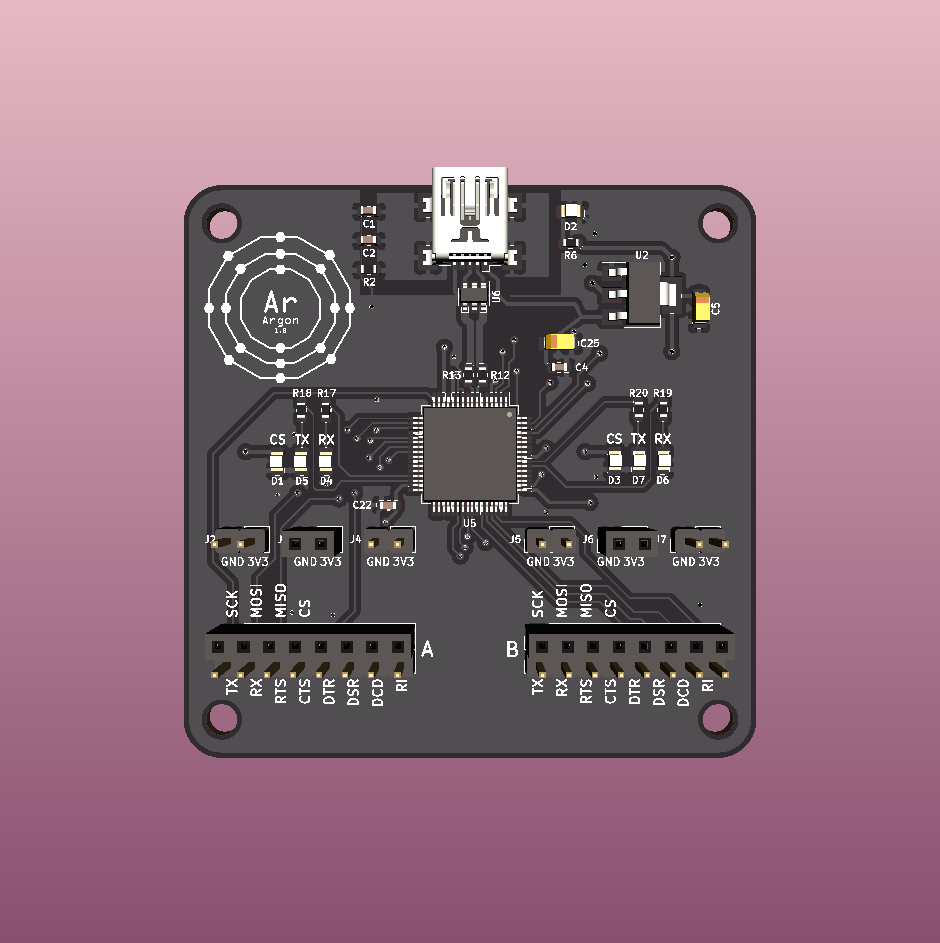
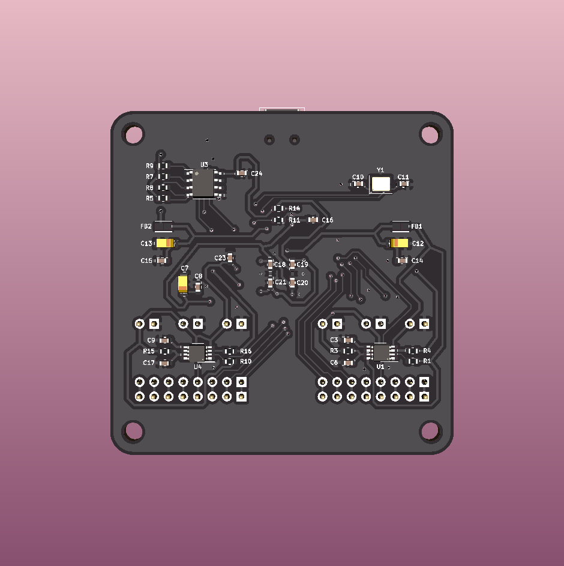
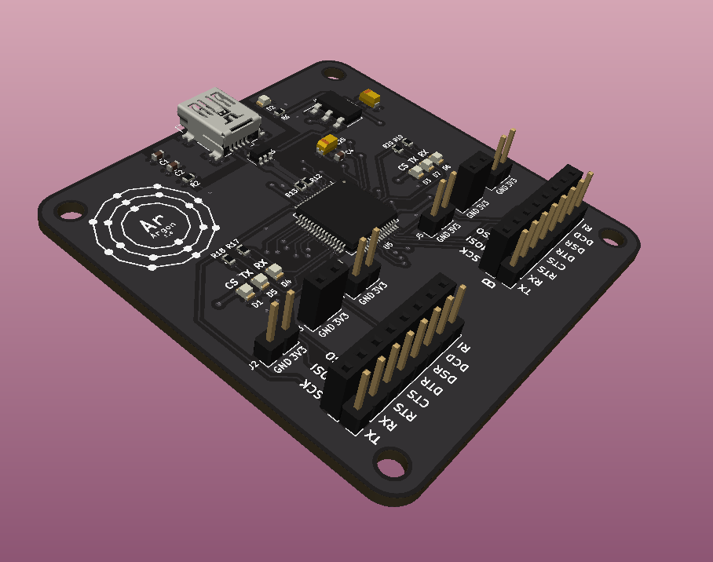
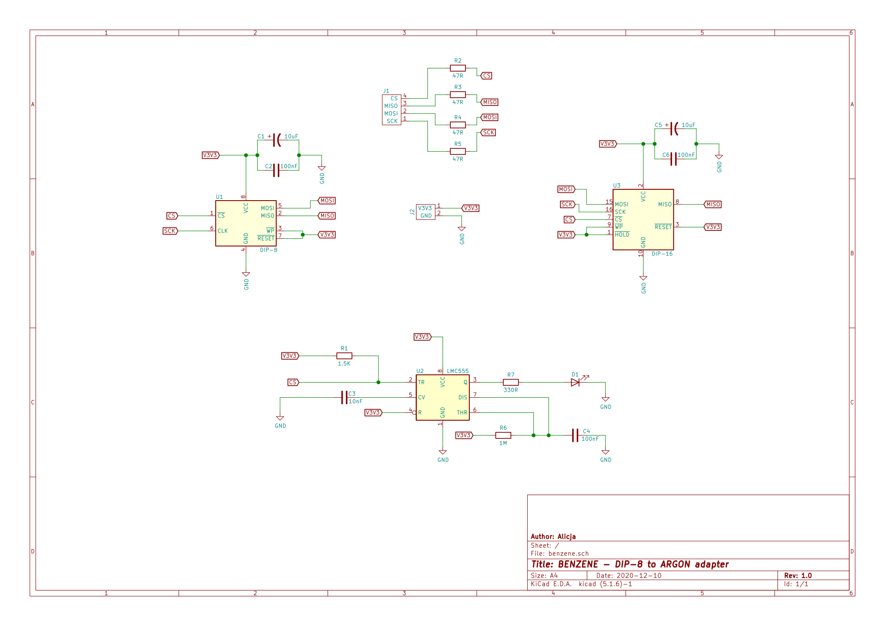
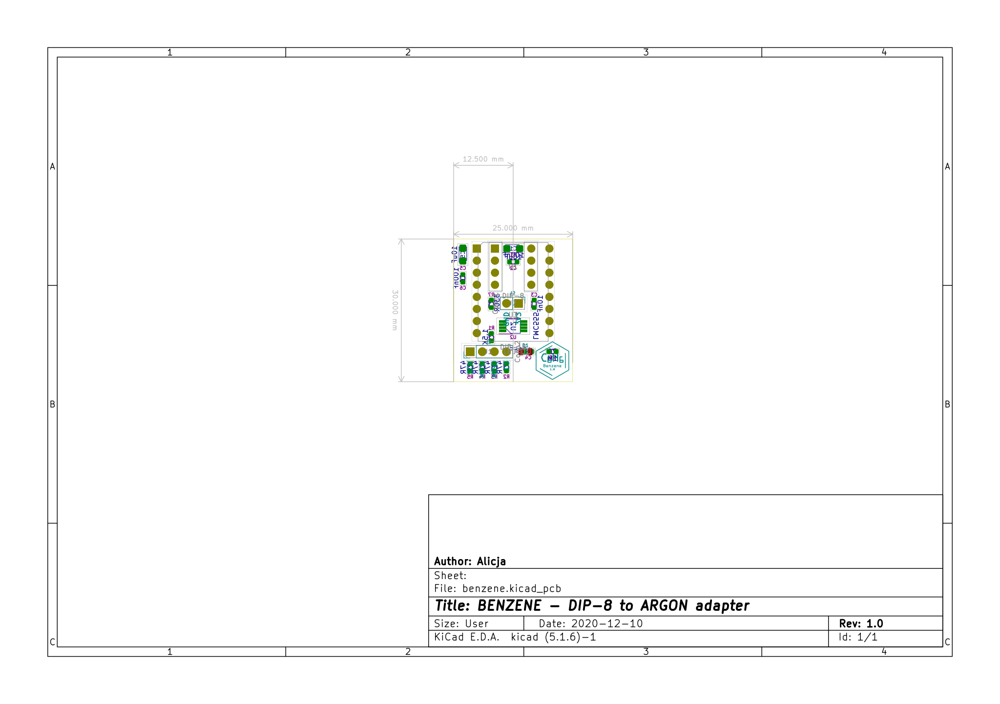
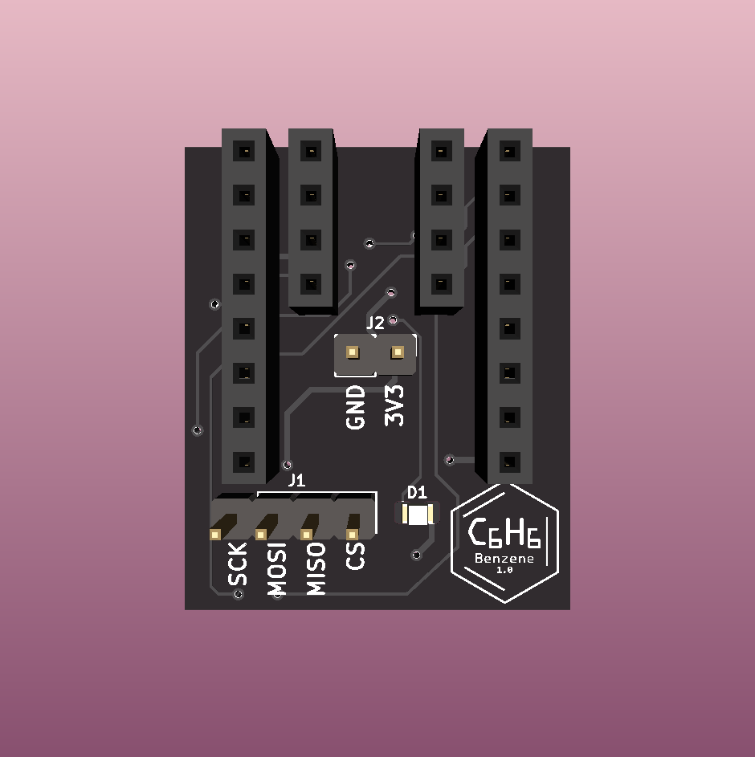
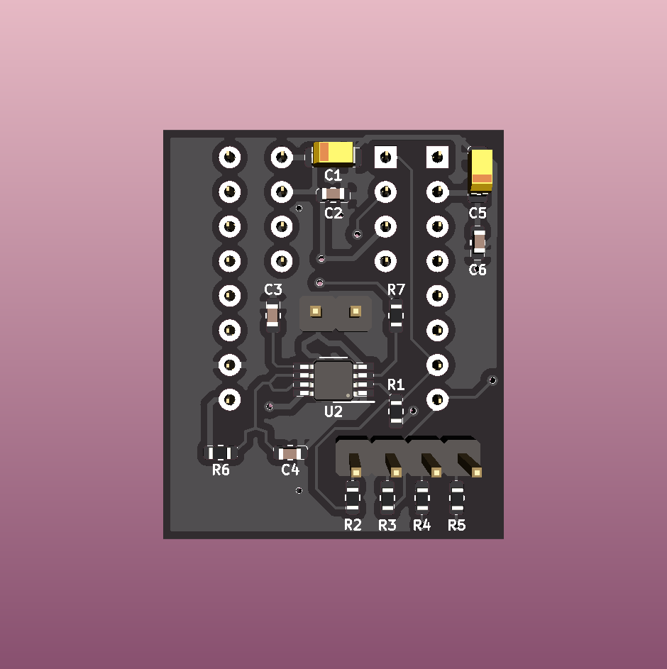
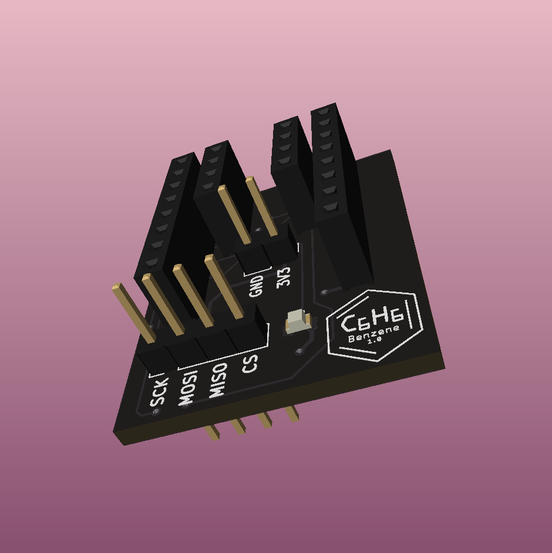

# Argon & Benzene - SPI NOR Flash programmer & reader

### 🟢 About the project

This project consists of two boards: **Argon** and **Benzene**.

 **Argon** is a SPI NOR Flash programmer & reader. It's based on the FT2232H microcontroller (with two UARTs - A & B). The board has three LED indicators of data - on TX, RX and CS lines and some sockets to be able to plug in the logic analyzer. Version 1.0 of Argon is available [in the releases section](https://github.com/alicjamusial/argon/releases/tag/argon-v.1.0). 

 

 **Benzene** is a DIP-8/DIP-16 to Argon adapter. It includes mostly a few capacitors and resistors to allow SPI Flash to run smoothly. There is also a 555 timer with LED indicator on CS line goldpins to attach the logic analyzer.
Version 1.0 of Benzene is available [in the releases section](https://github.com/alicjamusial/argon/releases/tag/benzene-v.1.0).

 
Argon works best with Benzene attached - they are designed to match each other (you can put two Benzene boards on top of the Argon). Argon can be also used separately as USB<->UART/FIFO/I2C/SPI converter (similar to FTDI Mini Module). 

Both boards were designed using [KiCad](https://kicad-pcb.org/).

### 🟢 Software
TBD: link to flash programmer/reader software

### 🟢 Known issues
**Argon 1.0**
- TX and RX LED indicators are designed incorrectly and they are turned on all the time, so they only turn themselves off when data is being transmitted (**will be fixed in 1.1**)
- A board is a little bit too small and spacers/screws in the mounting holes cover the captions in the corners (**will be fixed in 1.1**)

**Benzene 1.0**
- Logo is too small and illegible (not very important, so won't be fixed by now)

### 🟢 Usage examples
TBD: photos of real boards

### 🟢 Schematics and designs
All of them can be found in the release packages.

#### Argon

#### Benzene

### 🟢 Other hints
When assembling your own Argon or Benzene please use LED's resistors calculated for your chosen colours.

### 🟢 License
Argon and Benzene are available on Creative Commons Attribution Share Alike 4.0 International license (more in [license file](LICENSE.txt)). You are free to use it, modify it and produce as many of your own boards as you need :)
